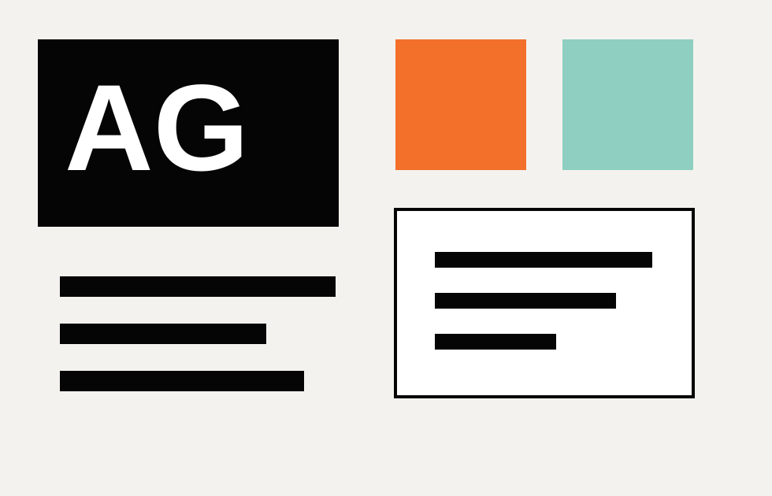

# Amber Grafic 网站人工修改指导说明

这份说明用于手动维护当前 GitHub Pages 个人网站。

- 线上地址：https://ambersuperbass-dev.github.io/
- 仓库地址：https://github.com/ambersuperbass-dev/ambersuperbass-dev.github.io
- 本地目录：`/Users/govinda/Desktop/AmberWeb`

## 1. 常用文件

```text
index.html              页面内容：简介、作品、链接、图片引用
assets/css/styles.css   页面样式：颜色、布局、字号、手机适配
assets/js/main.js       作品筛选逻辑
assets/img/             图片和 SVG 素材
README.md               仓库说明
EDITING_GUIDE.md        本说明
```

日常修改优先改 `index.html`。只有要调整视觉风格时再改 `assets/css/styles.css`。

## 2. 修改网站标题和搜索摘要

在 `index.html` 顶部 `<head>` 中修改：

```html
<title>Amber Grafic | Designer & Illustrator</title>
<meta name="description" content="...">
<meta property="og:title" content="Amber Grafic">
<meta property="og:description" content="...">
<meta property="og:image" content="assets/img/og-amber-grafic.svg">
```

用途：

- `title`：浏览器标签和搜索结果标题。
- `description`：搜索和分享摘要。
- `og:image`：社交平台分享预览图。

## 3. 修改顶部导航

顶部导航在：

```html
<header class="site-header" aria-label="Primary">
```

品牌名：

```html
<span>Amber</span>
<span>Grafic</span>
```

导航：

```html
<a href="#work">Work</a>
<a href="#about">About</a>
<a href="#contact">Contact</a>
```

`href="#work"` 会跳到页面里 `id="work"` 的区块。修改时要保留 `#` 和对应 `id`。

## 4. 修改首页首屏

首屏在：

```html
<section class="hero" aria-labelledby="hero-title">
```

小标题：

```html
<p class="eyebrow">Designer / Illustrator / Art & Design</p>
```

主标题：

```html
<h1 id="hero-title">Amber Grafic</h1>
```

简介：

```html
<p class="hero__summary">
  Original visual design, illustration and brand storytelling...
</p>
```

客户列表：

```html
<div class="hero__proof" aria-label="Selected client list">
  <span>Hermes</span>
  <span>Swarovski</span>
  ...
</div>
```

新增客户时复制一个 `<span>客户名</span>` 即可。

## 5. 修改作品筛选标签

筛选标签在：

```html
<form class="filters" aria-label="Project filters">
```

单个筛选项示例：

```html
<label>
  <input type="radio" name="filter" value="illustration">
  <span>Illustration</span>
</label>
```

规则：

- `value="illustration"` 是筛选用的内部标签。
- `<span>Illustration</span>` 是页面上显示的文字。
- 项目卡片的 `data-tags` 必须包含同样的标签，筛选才会生效。

## 6. 修改作品卡片

作品卡片在：

```html
<div class="project-grid" aria-live="polite">
```

单个项目示例：

```html
<article class="project-card" data-tags="illustration brand campaign">
  <a href="https://www.behance.net/iemihssu" rel="noopener noreferrer" target="_blank">
    
    <span class="project-card__meta">Illustration / Brand</span>
    <h3>Luxury Visual Design</h3>
    <p>Selected client-facing illustration and design work for luxury and lifestyle brands.</p>
  </a>
</article>
```

可修改内容：

- `data-tags`：筛选标签，多个标签用空格分开。
- `href`：点击卡片后的链接，当前统一指向 Behance。
- `img src`：缩略图路径。
- `alt`：图片说明。
- `project-card__meta`：项目类别。
- `h3`：项目标题。
- `p`：项目简介。

新增项目：

1. 复制一整个 `<article class="project-card">...</article>`。
2. 粘贴到 `project-grid` 内。
3. 修改标题、类别、简介、图片和链接。
4. 确保 `data-tags` 中包含已有筛选标签，例如 `illustration`、`brand`、`campaign`、`packaging`、`digital`。

删除项目：

- 删除对应的整段 `<article class="project-card">...</article>`。

## 7. 修改 About Me

About 区块在：

```html
<section class="about" id="about" aria-labelledby="about-title">
```

当前简介文字：

```html
Aspiring, motivated and always passionate about art and design...
```

服务列表在：

```html
<dl class="services">
```

示例：

```html
<div>
  <dt>Design</dt>
  <dd>Brand visuals, campaign systems, layout and market-ready assets.</dd>
</div>
```

`dt` 是服务标题，`dd` 是说明。

## 8. 修改联系方式

页脚在：

```html
<footer class="contact" id="contact">
```

邮箱：

```html
<a href="mailto:hello@ambergrafic.studio">hello@ambergrafic.studio</a>
```

修改邮箱时要同时修改：

- `href="mailto:新邮箱"`
- 标签中间显示的 `新邮箱`

Behance 链接：

```html
<a href="https://www.behance.net/iemihssu" target="_blank">Behance</a>
```

## 9. 替换图片

图片放在：

```text
assets/img/
```

支持格式：

- `.svg`
- `.png`
- `.jpg`
- `.webp`

建议：

- 作品缩略图使用横向图或方图。
- 文件名用小写英文、数字和连字符，例如 `hermes-illustration.jpg`。
- 不建议文件名含空格或中文。

替换步骤：

1. 把新图放入 `assets/img/`。
2. 在 `index.html` 中把 `src="assets/img/旧文件名"` 改成新文件名。
3. 同时修改 `alt`，简单描述图片内容。

## 10. 修改颜色和整体风格

颜色在 `assets/css/styles.css` 顶部：

```css
:root {
  --black: #111111;
  --white: #ffffff;
  --paper: #f7f6f2;
  --muted: #6f6d68;
  --line: #d8d5cd;
  --accent: #b56d45;
}
```

常见修改：

- 背景色：改 `--paper`。
- 强调色：改 `--accent`。
- 次要文字：改 `--muted`。

主要样式区块：

- `.site-header`：顶部导航。
- `.hero`：首屏。
- `.work-section`：作品区。
- `.project-grid` / `.project-card`：作品网格和卡片。
- `.about`：个人介绍。
- `.contact`：页脚。
- `@media (max-width: 520px)`：手机端样式。

## 11. 本地预览

可以直接打开：

```text
/Users/govinda/Desktop/AmberWeb/index.html
```

更接近线上环境的方式：

```bash
cd /Users/govinda/Desktop/AmberWeb
python3 -m http.server 8000
```

然后访问：

```text
http://127.0.0.1:8000/
```

检查重点：

- 首屏文字是否清楚。
- 作品筛选是否有效。
- 图片是否全部加载。
- 手机端是否有文字溢出。
- 链接是否跳到正确页面。

## 12. 发布更新

修改完成后执行：

```bash
cd /Users/govinda/Desktop/AmberWeb
git status
git add -A
git commit -m "Update website content"
git push
```

线上地址：

```text
https://ambersuperbass-dev.github.io/
```

GitHub Pages 可能有几分钟缓存。

## 13. 常见问题

### 图片不显示

检查：

- 图片是否在 `assets/img/`。
- `src` 路径是否拼写正确。
- 文件名大小写是否一致。
- 文件名是否含空格或中文。

### 筛选无效

检查：

- 筛选按钮的 `value`。
- 项目卡片的 `data-tags`。
- `index.html` 底部是否还引用 JS：

```html
<script src="assets/js/main.js"></script>
```

### 线上没有立刻更新

检查：

- 是否执行了 `git push`。
- GitHub Pages 是否还在构建。
- 浏览器是否缓存旧页面。

## 14. 后续自定义域名

如果购买了 `ambergrafic.com` 或类似域名，需要：

1. 在仓库根目录添加 `CNAME` 文件。
2. 在 GitHub Pages 设置中填写 custom domain。
3. 在域名服务商后台配置 DNS。

例如 `CNAME` 文件内容：

```text
www.ambergrafic.com
```
