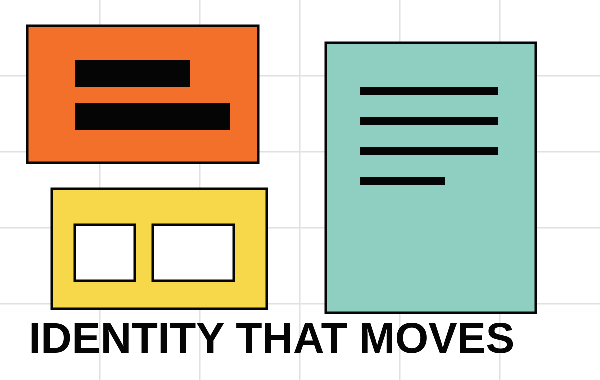
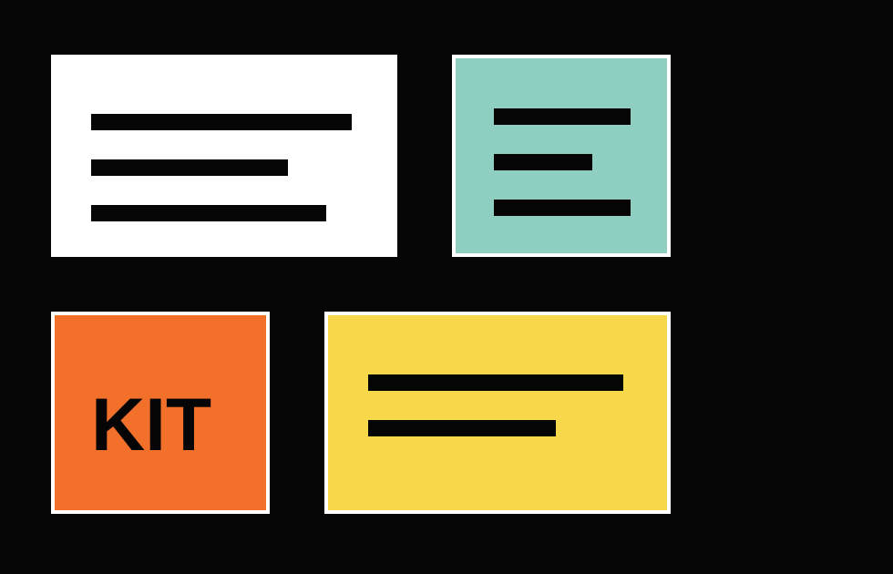
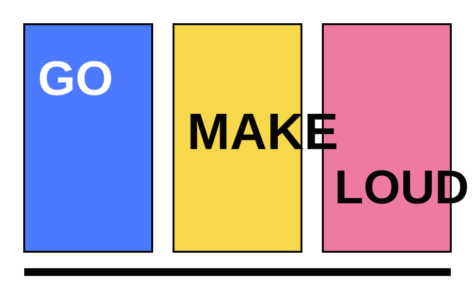
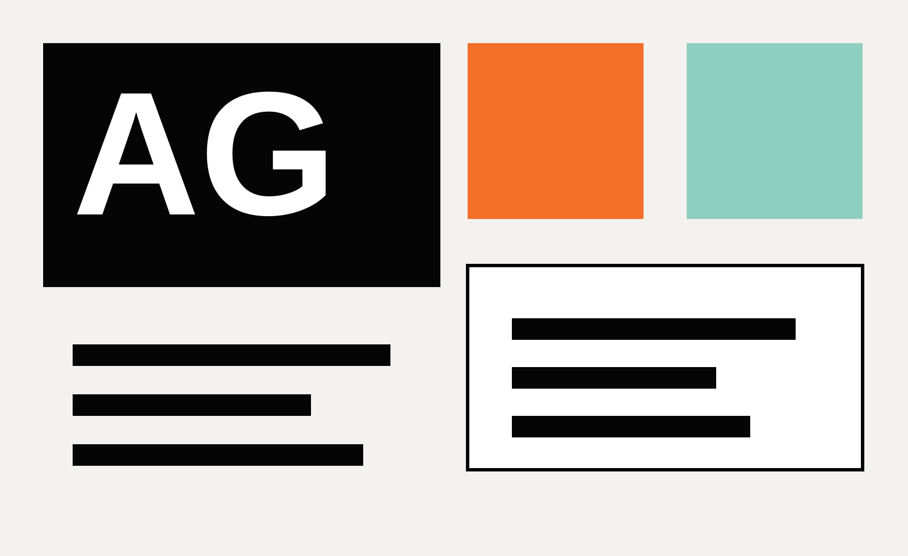

# Amber Grafic 网站人工修改指导说明

这份说明用于手动维护已经发布到 GitHub Pages 的个人网站：

- 线上地址：https://ambersuperbass-dev.github.io/
- 仓库地址：https://github.com/ambersuperbass-dev/ambersuperbass-dev.github.io
- 本地目录：`/Users/govinda/Desktop/AmberWeb`

## 1. 文件结构

主要只需要改这几个位置：

```text
index.html              页面内容：文字、项目、链接、图片引用
assets/css/styles.css   页面样式：颜色、字号、布局、移动端适配
assets/js/main.js       项目筛选和 Spotlight 滚动信息切换
assets/img/             图片和 SVG 视觉素材
README.md               仓库说明
EDITING_GUIDE.md        这份人工修改说明
```

一般修改文字和项目内容时，优先改 `index.html`；只有要改视觉风格时再改 `assets/css/styles.css`。

## 2. 修改网站基础信息

在 `index.html` 顶部 `<head>` 中修改这些内容：

```html
<title>Amber Grafic | Brand Design & Marketing</title>
<meta name="description" content="...">
<meta property="og:title" content="Amber Grafic">
<meta property="og:description" content="...">
<meta property="og:image" content="assets/img/og-amber-grafic.svg">
```

用途：

- `title`：浏览器标签页标题，也影响搜索结果标题。
- `description`：搜索引擎和社交分享摘要。
- `og:image`：分享到社交平台时显示的预览图。

如果替换分享图，把新文件放进 `assets/img/`，再把 `content` 改成对应路径。

## 3. 修改顶部导航

顶部导航在 `index.html` 的 `<header class="site-header">` 里：

```html
<a class="brand-mark" href="#top" aria-label="Amber Grafic home">
  <span>Amber</span>
  <span>Grafic</span>
</a>

<nav class="site-nav" aria-label="Site">
  <a href="#work">Work</a>
  <a href="#about">Info</a>
  <a href="#contact">Contact</a>
</nav>
```

可以修改：

- 品牌名：改两个 `<span>` 里的文字。
- 导航文字：改 `Work`、`Info`、`Contact`。
- 导航目标：`href="#work"` 对应页面里 `id="work"` 的区块。

不要随便删除 `href="#..."`，否则点击导航会失效。

## 4. 修改首页首屏文案

首屏在 `index.html` 的 `<section class="hero">` 里。

主标题：

```html
<h1 id="hero-title">Amber Grafic</h1>
```

简介：

```html
<p>
  Graphic designer shaping brand identities and marketing visuals
  that move cleanly from idea to market.
</p>
```

当前工作状态：

```html
<p><strong>Currently creating:</strong></p>
<p>Identity systems, launch campaigns, social-first visual stories.</p>
```

首屏浮动图片：

```html



```

如果要换图：

1. 把新图片放到 `assets/img/`。
2. 修改对应的 `src="assets/img/文件名"`。
3. 建议使用横向图，避免首屏裁切太严重。

## 5. 修改项目筛选标签

筛选标签在 `<form class="filters">` 里：

```html
<label>
  <input type="radio" name="filter" value="brand">
  <span>Brand Identity</span>
</label>
```

关键规则：

- `value="brand"` 是内部筛选值。
- `<span>Brand Identity</span>` 是用户看到的文字。
- 项目卡片的 `data-tags` 必须包含同样的值，筛选才会生效。

例如新增一个筛选：

```html
<label>
  <input type="radio" name="filter" value="print">
  <span>Print</span>
</label>
```

对应项目卡片需要写：

```html
data-tags="brand print"
```

## 6. 修改项目卡片

项目卡片在 `<div class="project-grid">` 里，每个项目是一个 `<article class="project-tile">`。

示例：

```html
<article
  class="project-tile"
  data-tags="brand marketing"
  data-title="A modular identity for Amber Office"
  data-meta="Brand Identity, Design System, Marketing Kit"
  data-year="2026"
>
  <a href="#spotlights">
    
    <span><strong>Amber Office</strong> Identity system</span>
  </a>
</article>
```

可以修改：

- `data-tags`：用于筛选，例如 `brand marketing digital`。
- `data-title`：给 JS / Spotlight 信息使用。
- `data-meta`：项目类型说明。
- `data-year`：项目年份。
- `img src`：项目缩略图。
- `img alt`：图片替代文字，建议简单描述图片内容。
- `<strong>Amber Office</strong>`：项目名称。
- `Identity system`：项目副标题。

新增项目：

1. 复制一整个 `<article class="project-tile">...</article>`。
2. 粘贴到 `project-grid` 内。
3. 修改文字、标签、年份和图片路径。
4. 确认 `data-tags` 里至少有一个筛选标签。

删除项目：

- 删除对应的整段 `<article class="project-tile">...</article>`。

## 7. 修改 Project Spotlights

Spotlight 区块在 `<section class="spotlights">` 里。

每个 Spotlight 是：

```html
<article
  class="spotlight"
  data-title="A modular identity for Amber Office"
  data-meta="Brand Identity, Design System, Marketing Kit"
  data-year="2026"
>
  <a href="#contact" style="--rotate: -2deg">
    
  </a>
</article>
```

可以修改：

- `data-title`：滚动到该项目时，页面中间显示的标题。
- `data-meta`：服务类型说明。
- `data-year`：年份。
- `style="--rotate: -2deg"`：图片旋转角度，可改成 `0deg`、`2deg`、`-3deg` 等。
- `img src`：大图路径。
- `alt`：图片说明。

如果想让 Spotlight 图窄一点，保留或添加：

```html
class="spotlight spotlight--narrow"
```

## 8. 修改个人介绍和服务

个人介绍在 `<section class="info" id="about">` 里。

英文介绍：

```html
Amber is a graphic designer focused on brand design and marketing...
```

中文介绍：

```html
平面设计师，专注品牌识别、营销视觉、社媒传播与产品上市所需的设计系统。
```

服务列表在 `<dl class="services">` 里：

```html
<div>
  <dt>Brand</dt>
  <dd>Logos, identity systems, typography, color, design guidelines.</dd>
</div>
```

可以修改 `dt` 作为服务名称，`dd` 作为说明。

## 9. 修改联系方式

页脚在 `index.html` 最底部 `<footer class="contact" id="contact">`。

邮箱：

```html
<a href="mailto:hello@ambergrafic.studio">hello@ambergrafic.studio</a>
```

修改时要同时改两个地方：

```html
href="mailto:新邮箱"
```

以及标签中间显示的文字：

```html
>新邮箱</a>
```

GitHub / 社交链接：

```html
<a href="https://github.com/ambersuperbass-dev" target="_blank">@ambersuperbass-dev</a>
```

可以改成 Instagram、Behance、小红书、LinkedIn 等链接。

## 10. 替换图片素材

当前图片都在：

```text
assets/img/
```

建议尺寸：

- 项目缩略图：约 `980 x 630`，横向。
- Spotlight 大图：约 `1600 x 980`，横向。
- 首屏主图：约 `1200 x 760`，横向。
- 分享预览图：`1200 x 630`。

支持格式：

- `.svg`
- `.png`
- `.jpg`
- `.webp`

替换方式：

1. 把新图放入 `assets/img/`。
2. 在 `index.html` 中把 `src="assets/img/旧文件名"` 改成新文件名。
3. 文件名建议只用小写英文、数字和连字符，例如 `brand-case-01.jpg`。

注意：

- 文件名大小写必须完全一致。
- 路径不要写成 `/assets/img/...`，保持 `assets/img/...` 更适合 GitHub Pages。

## 11. 修改颜色和视觉风格

颜色集中在 `assets/css/styles.css` 顶部：

```css
:root {
  --black: #050505;
  --white: #ffffff;
  --paper: #f7f8fa;
  --mint: #8fcfc1;
  --orange: #f2702a;
  --yellow: #f7d84b;
  --blue: #4b79ff;
  --pink: #ee7aa4;
  --green: #315f4f;
}
```

常见修改：

- 页面背景：改 `--paper`。
- 强调色：改 `--orange`、`--mint`、`--yellow` 等。
- 文字黑色：通常不要改 `--black`，除非整体重做。

主要布局位置：

- `.hero`：首屏。
- `.project-grid`：项目网格。
- `.spotlights`：大图滚动区。
- `.info`：个人介绍。
- `.contact`：页脚。
- `@media (max-width: 720px)`：手机端样式。

修改 CSS 后一定要同时看桌面和手机效果。

## 12. 本地预览

最简单方式：

- 直接打开：`/Users/govinda/Desktop/AmberWeb/index.html`

更接近线上方式：

```bash
cd /Users/govinda/Desktop/AmberWeb
python3 -m http.server 8000
```

然后打开：

```text
http://127.0.0.1:8000/
```

检查重点：

- 首页是否正常显示。
- 导航能否跳转。
- 项目筛选是否有效。
- 图片是否全部加载。
- 手机宽度下文字是否溢出。

## 13. 发布更新到 GitHub Pages

修改完成后，在终端执行：

```bash
cd /Users/govinda/Desktop/AmberWeb
git status
git add -A
git commit -m "Update website content"
git push
```

发布后访问：

```text
https://ambersuperbass-dev.github.io/
```

GitHub Pages 有缓存，更新后可能需要等待几分钟。

## 14. 常见问题

### 图片不显示

检查：

- 图片是否真的放在 `assets/img/`。
- `src` 路径是否拼写正确。
- 文件名大小写是否一致。
- 文件名是否含空格或中文。建议不用空格和中文。

### 筛选按钮点了没反应

检查：

- 筛选按钮的 `value` 是否存在。
- 项目卡片的 `data-tags` 是否包含相同单词。
- `assets/js/main.js` 是否还被 `index.html` 引用：

```html
<script src="assets/js/main.js"></script>
```

### 手机端文字被挤出屏幕

优先检查：

- 标题是否太长。
- 项目名称是否太长。
- 是否改动了 `@media (max-width: 720px)` 中的样式。

### 线上没有立刻更新

常见原因：

- 没有执行 `git push`。
- GitHub Pages 还在构建或缓存。
- 浏览器缓存旧页面。可以强制刷新或稍等几分钟。

## 15. 后续接入自定义域名

如果之后购买了 `ambergrafic.com` 或类似域名，需要：

1. 在仓库根目录添加 `CNAME` 文件，内容写自定义域名。
2. 在 GitHub Pages 设置里确认 custom domain。
3. 在域名服务商后台配置 DNS。

例如 `CNAME` 文件内容：

```text
www.ambergrafic.com
```

DNS 配置完成后，GitHub Pages 可能需要一段时间生效。
